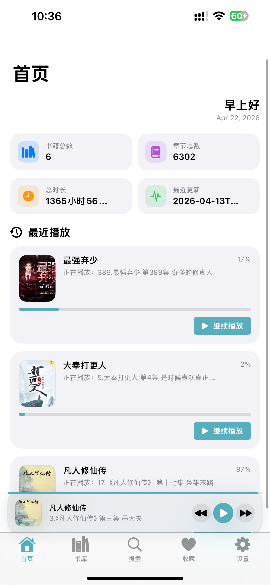
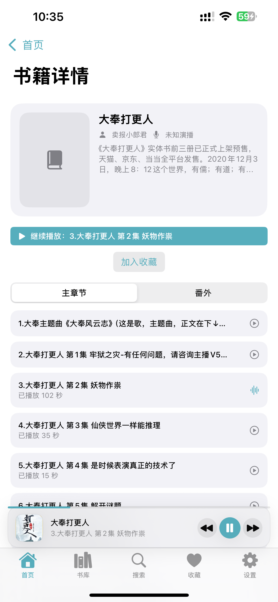
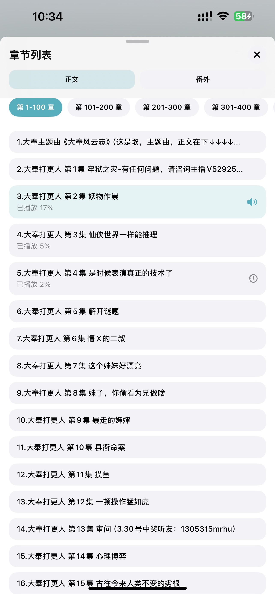
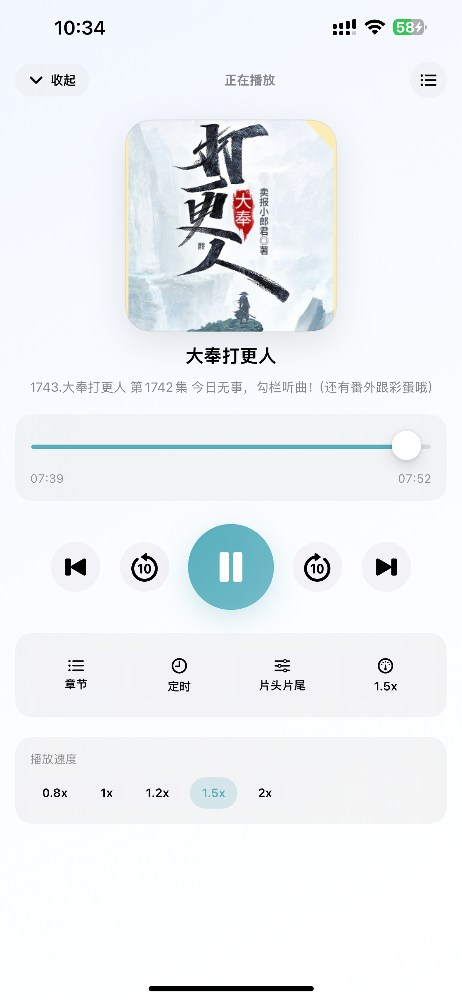
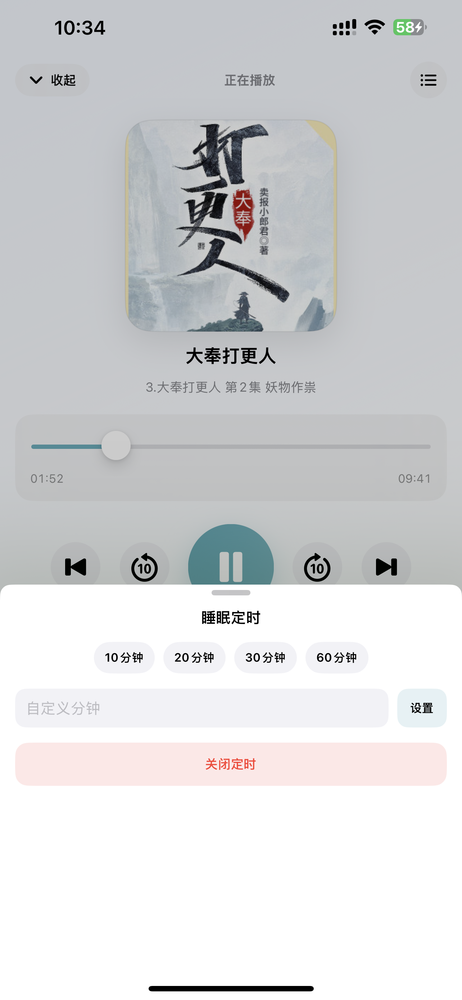
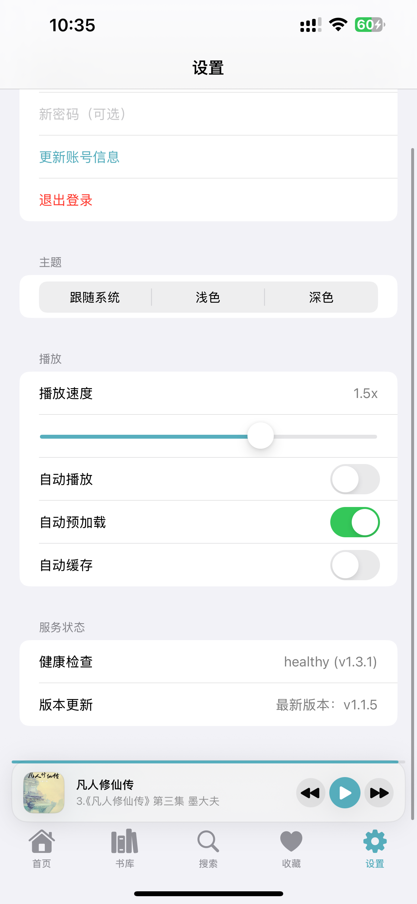

# Ting Reader iOS App

一个基于 [ting-reader](https://github.com/dqsq2e2/ting-reader.git) 后端数据服务的 iOS 听书应用，面向中文有声书场景，提供更轻量、更专注的移动端收听体验。

## 项目简介

本工程是 `ting-reader` 的 iOS 客户端实现，围绕“打开即听”的使用方式，提供书库管理、章节浏览、播放控制、进度续听与个性化设置等核心能力。应用界面以简洁、清爽、易读为主，适合作为个人有声书库的移动端入口。

依托 `ting-reader` 后端的数据管理能力，应用可以更好地组织书籍、章节、作者、演播者等内容信息，并在移动端提供更稳定、更连贯的收听体验。

## 功能特性

- 书库浏览与书籍详情查看
- 章节列表快速切换，支持正文与番外分类查看
- 沉浸式播放界面，支持进度拖动、上一集/下一集、快进快退
- 最近播放与继续播放，方便断点续听
- 收藏管理与搜索入口，提升内容查找效率
- 睡眠定时、倍速播放、片头片尾跳过等常用听书功能
- 自动预加载、自动缓存、主题切换等个性化设置
- 基于后端服务的数据组织与状态管理能力

## 后端数据来源

本项目以前端 iOS App 的形式接入以下后端项目作为数据来源：

- 后端仓库: [dqsq2e2/ting-reader](https://github.com/dqsq2e2/ting-reader.git)

## 界面预览

<table>
  <tr>
    <td align="center" width="50%">
      <strong>首页</strong> 
      展示书库统计、最近播放与快速续听入口  
      
    </td>
    <td align="center" width="50%">
      <strong>书籍详情</strong> 
      查看作品信息、章节内容与播放进度  
      
    </td>
  </tr>
  <tr>
    <td align="center" width="50%">
      <strong>章节列表</strong> 
      支持正文与番外切换，快速定位章节  
      
    </td>
    <td align="center" width="50%">
      <strong>播放页</strong> 
      支持倍速、跳转、定时与片头片尾控制  
      
    </td>
  </tr>
  <tr>
    <td align="center" width="50%">
      <strong>睡眠定时</strong> 
      内置常用定时选项，适合夜间收听场景  
      
    </td>
    <td align="center" width="50%">
      <strong>设置页</strong> 
      提供主题、播放偏好与服务状态配置  
      
    </td>
  </tr>
</table>

## 适用场景

适合用于：

- 个人有声书库的 iPhone 客户端
- 基于 `ting-reader` 后端能力的移动端听书方案
- 有声内容管理、播放与收听体验验证
